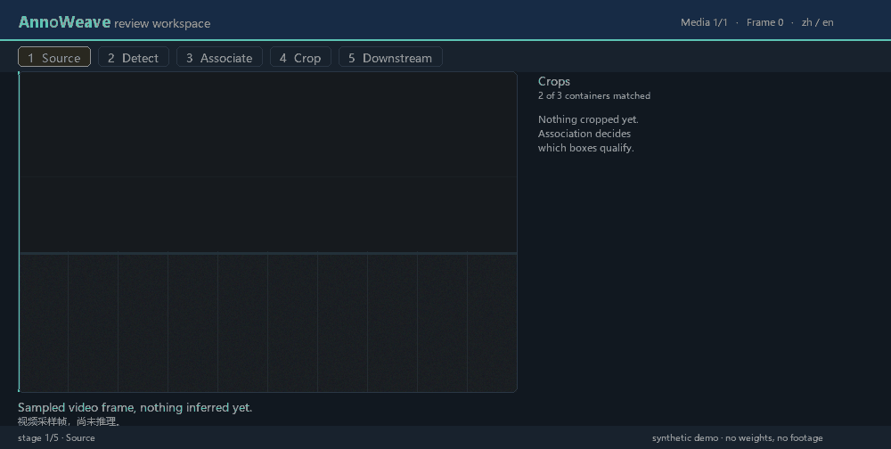

# AnnoWeave

**Local visual AI inference, annotation, association, cropping, and human review.**


[简体中文](README_zh-CN.md) · [Getting started](docs/en/getting-started.md) · [Workflow tutorial](docs/en/workflow-tutorial.md) · [Build for Windows](docs/en/building-windows.md) · [Release checklist](docs/en/release-checklist.md)

AnnoWeave turns image and sampled-video processing into configurable nodes: full-frame inference, spatial association, evidence crops, downstream inference, editing, review, and dataset export. Media, weights, project databases, and workflow settings stay on the local machine.

No model weights are bundled. The first launch is intentionally empty — you point the app at your own local ONNX models.

## How it works



Two full-frame detectors run on the same frame. A spatial rule decides which marker belongs to which container, only the matched containers are cropped, and a classifier scores each crop. Every step is a node and every node is replaceable; the pairing shown in the third step comes from the real association node, and the fourth step visibly skips the container that matched nothing.

The animation is generated by [`tools/make_demo_gifs.py`](tools/make_demo_gifs.py) from procedural geometry — no footage and no model weights — so it is reproducible rather than a hand-made binary.

## Highlights

- Review individual images, selected files, folders, and sampled video frames in one workspace.
- Add, move, resize, relabel, and remove boxes on full frames and crops.
- Compose multiple ONNX models with full-frame, cascade, association, ROI, and count nodes.
- Recompute crops and downstream results after an upstream annotation changes.
- Run batch jobs with immutable workflow/model snapshots and export review or training artifacts.
- Extend the node registry with local plugins.
- Chinese and English UI; run from source or build a standalone Windows executable.

## Requirements

| | |
|---|---|
| OS | Windows 10/11 x64 |
| Python | 64-bit CPython 3.10 – 3.13 (**3.12 or 3.13 recommended**) |
| Disk | ~1.5 GB for the environment (PySide6 and ONNX Runtime are large) |
| GPU (optional) | NVIDIA driver matching the `onnxruntime-gpu` build |

## Install

### One command (recommended)

```powershell
git clone https://github.com/backward052/AnnoWeave.git
cd AnnoWeave
.\scripts\setup.ps1
```

`setup.ps1` finds a compatible 64-bit Python, creates `.venv`, installs dependencies, verifies the imports, and runs the test suite. If it fails it prints the exact command to run next.

If PowerShell refuses to run the script, allow it for this window only:

```powershell
Set-ExecutionPolicy -Scope Process Bypass
```

### Manual install

```powershell
py -3.12 -m venv .venv
.\.venv\Scripts\Activate.ps1
python -m pip install --upgrade pip
pip install -e ".[cpu]"
annoweave
```

Use `.[gpu]` for the NVIDIA CUDA ONNX Runtime package. Do not install both Runtime packages in one environment.

### Then start it

```powershell
.\scripts\run.ps1
```

## Troubleshooting the install

| Symptom | Fix |
|---|---|
| `py -3.11` / `py -3.12` says *No suitable Python runtime found* | You do not have that version. Run `py -0p` to list what you do have, then use setup.ps1, which picks a supported version automatically: `winget install Python.Python.3.12` |
| `Activate.ps1 cannot be loaded because running scripts is disabled` | `Set-ExecutionPolicy -Scope Process Bypass`, then retry. Or skip activation and call the interpreter directly: `.\.venv\Scripts\python.exe -m annoweave` |
| `No module named 'PySide6'` when launching | The app is not installed in the active interpreter. Run `.\scripts\setup.ps1`, or `.\.venv\Scripts\python.exe -m pip install -e ".[cpu]"` |
| `Could not find a version that satisfies the requirement onnxruntime` | You are on 32-bit Python, or on Python 3.14+. Install 64-bit Python 3.12. |
| pip fails behind a corporate proxy or TLS inspection | `.\.venv\Scripts\python.exe -m pip install -e ".[cpu]" --proxy http://host:port` or add `--trusted-host pypi.org --trusted-host files.pythonhosted.org` |
| ONNX Runtime loads but the model fails to run | Check that you did not install `onnxruntime` and `onnxruntime-gpu` together. Rebuild with `.\scripts\setup.ps1 -Recreate`. |
| The window opens but is empty | That is expected on a fresh install. Add a model on the Model Library page first — see [Getting started](docs/en/getting-started.md). |
| Very long paths break Qt or the build | Keep the repository and `.venv` on a short path such as `D:\AnnoWeave`. |

## Build the Windows application

```powershell
.\scripts\setup.ps1            # once, to create .venv
.\scripts\build.ps1 -Runtime cpu
```

The executable is created at `dist\AnnoWeave\AnnoWeave.exe`. Distribute the whole `dist\AnnoWeave` directory, not the `.exe` alone. See the [Windows build guide](docs/en/building-windows.md).

## Workflow quick path

1. Add local ONNX weights on the **Model Library** page: unique name, model type, input size, and the complete ordered class list.
2. On the **Workflows** page, choose a generic template and map models to its responsibility slots.
3. Check the data keys on the node canvas: every inference output key must match what the association, crop, or rule nodes reference.
4. Run the preflight check, then run the pipeline on a non-sensitive test image.
5. Save, switch to **Review**, run the current frame, and inspect the full frame, crops, and downstream results.

Try the bundled example workflow: import `examples/workflows/associate-crop-infer.json` from the Workflows page menu, then register models with the same names. See also [examples/plugins](examples/plugins) for a minimal plugin node.

## Repository layout

```text
.github/                 CI and issue templates
docs/                    English and Chinese documentation
docs/assets/             README demo animation (generated)
examples/                generic workflow and plugin examples
packaging/pyinstaller/   executable packaging
scripts/                 setup, run, build, and release checks
src/annoweave/           application source
tests/                   public behavior and release-boundary tests
tools/                   maintainer tooling (demo animation generator)
pyproject.toml           dependencies, entry point, and tool settings
```

## Local data locations

Runtime data defaults to `%LOCALAPPDATA%\AnnoWeave` and never touches the repository.

Set `ANNOWEAVE_CONFIG_DIR` to keep **everything** in one custom directory instead — model library, workflow catalog, per-project review databases, label catalog, plugins, review sessions, and the precompute cache:

```powershell
$env:ANNOWEAVE_CONFIG_DIR = "D:\AnnoWeaveData"
.\scripts\run.ps1
```

## Development

```powershell
.\scripts\setup.ps1              # installs the dev extras too
.\.venv\Scripts\python.exe -m pytest
.\.venv\Scripts\python.exe -m ruff check src tests
```

Set `QT_QPA_PLATFORM=offscreen` to run the UI tests without a visible window. See [CONTRIBUTING.md](CONTRIBUTING.md).

## Public repository boundary

This repository excludes model weights, media, databases, user sessions, logs, exports, and production workflows. Run `./scripts/check-release.ps1` before publishing. The examples describe generic patterns and contain no production model names, class names, thresholds, or workflow topology.

## Acknowledgements

AnnoWeave is not a fork of the projects below and shares no code or assets with them. They are cited because they shaped its design or complement it, and no material is copied from either — X-AnyLabeling in particular is GPL-3.0, which is why nothing from it is vendored here.

- **[VideoPipe](https://github.com/sherlockchou86/VideoPipe)** (Apache-2.0) — a cross-platform video-structuring framework built from discrete inference nodes. Its "one module does one thing, nodes connect through explicit data keys" model is what AnnoWeave's node graph follows, and the generic three-model tutorial is written in that idiom.
- **[X-AnyLabeling](https://github.com/CVHub520/X-AnyLabeling)** (GPL-3.0) — a desktop annotation tool with a broad model zoo and many export formats. Use it when you need to *create* a dataset; use AnnoWeave when you need to *run and review* a multi-model pipeline and trace how each result was produced.

## Status and license

AnnoWeave is alpha software; expect breaking changes between minor versions. See [CHANGELOG.md](CHANGELOG.md).

Released under the [MIT License](LICENSE).
